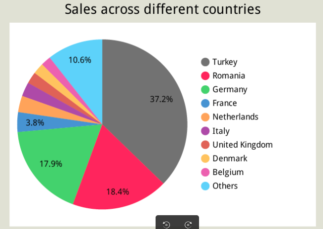

# Glamira Customer Behavior Data Transformation Project

## Table of Contents
1. [Overview](#overview)
2. [Installation Requirements](#installation-requirements)
3. [Data Pipeline Workflow](#data-pipeline-workflow)
4. [Uploading Data to BigQuery](#uploading-data-to-bigquery)
5. [Project Structure](#project-structure)
6. [Data Warehouse Layers](#data-warehouse-layers)
7. [Contributing](#contributing)

---

## Overview
This project focuses on augmenting data from the Glamira website and combining it with existing datasets to transform over 41 million records of customer behavior data into actionable insights. It leverages a wide array of tools including MongoDB, DBT, BigQuery, Google Cloud Storage, Looker, and potentially virtual machines (VMs) for performance optimization when handling large datasets.

---

## Installation Requirements

To successfully run the project, ensure the following are installed and configured:

- Libraries and dependencies specific to each component of the project as detailed in the respective tutorials.
- Google Cloud SDK installed and configured either on your local machine or a GCP Virtual Machine (VM).

### About Google Cloud SDK
Google Cloud SDK is a command-line toolkit for managing Google Cloud resources. It includes:

1. **gcloud**: Manage Google Cloud services (e.g., create buckets, configure projects, deploy Cloud Functions).
2. **gsutil**: Interact with Google Cloud Storage (e.g., upload/download files, manage buckets).
3. **bq**: Work with BigQuery (e.g., run queries, load data).

#### Installing Google Cloud SDK on Ubuntu:
1. Update package lists and install prerequisites:
   ```bash
   sudo apt update && sudo apt install apt-transport-https ca-certificates gnupg
   ```
2. Add the Cloud SDK distribution URI as a package source:
   ```bash
   echo "deb [signed-by=/usr/share/keyrings/cloud.google.gpg] https://packages.cloud.google.com/apt cloud-sdk main" | sudo tee -a /etc/apt/sources.list.d/google-cloud-sdk.list
   ```
3. Import the Google Cloud public key:
   ```bash
   curl https://packages.cloud.google.com/apt/doc/apt-key.gpg | sudo apt-key --keyring /usr/share/keyrings/cloud.google.gpg add -
   ```
4. Install the Cloud SDK:
   ```bash
   sudo apt update && sudo apt install google-cloud-sdk
   ```
5. Authenticate and configure:
   ```bash
   gcloud auth login
   gcloud config set project [PROJECT_ID]
   ```

---

## Data Pipeline Workflow


1. **Data Crawling:**
   - Extract `product_name` using `product_id` and `current_url` from collections like `view_product_detail`, `select_product_option`, and `select_product_option_quality`.
   - Save the data into a CSV file.

2. **IP Mapping:**
   - Map IPs from over 41 million records to specific locations (country, region, city) and save as a CSV file.

3. **Data Export to Google Cloud Storage:**
   - Export raw data from MongoDB, the `product_name` CSV, and the `location` CSV to Google Cloud Storage.
   - Use either the Google Cloud Console interface or Cloud Functions to transfer this data to BigQuery.

4. **DBT Processing:**
   - Set up a connection between DBT and BigQuery.
   - Process and transform the data using DBT models and return the final datasets.

5. **Visualization with Looker:**
   - Use Looker to create visualizations and derive actionable insights from the transformed data.

---

## Uploading Data to BigQuery

### Using the Google Cloud Console:

1. **Prepare File on GCS:**
   - Upload the file (CSV, JSON, Avro, etc.) to Google Cloud Storage.

2. **Access BigQuery:**
   - Open BigQuery via the Google Cloud Console.

3. **Create Table:**
   - Select the appropriate dataset and click **+ Create Table**.
   - Configure the following:
     - **Source:** Choose Google Cloud Storage and provide the GCS URI (e.g., `gs://bucket-name/file.csv`).
     - **Schema:** Use Auto Detect or manually define it.
     - Click **Create Table** to import the data.

### Using Cloud Functions:

For streaming data directly from GCS to BigQuery, refer to:
- [Google Cloud Blog Guide](https://cloud.google.com/blog/products/storage-data-transfer/streaming-data-from-cloud-storage-into-bigquery-using-cloud-functions)
- [GitHub Example](https://github.com/GoogleCloudPlatform/solutions-gcs-bq-streaming-functions-python)

---

## Project Structure

```plaintext
crawling_product_name/
├── crawling_name.py                         # Main script for product name crawling.
├── product_name_data.csv                    # Product name data by product_id.
├── README.md                                # Description and usage guide for this module.

mapping_IP2Loc/
├── ip2location.py                           # Main script for IP-to-location mapping.
├── IP-COUNTRY-REGION-CITY.zip               # Extract to get Binary data for IP-to-location mapping.
├── ip_location_mapping.csv                  # User location data derived from IPs.
├── README.md                                # Description and usage guide for this module.

configure_VM/
├── README.md                                # Guide to configure VM for the project.

dbt_project/                                 # Description and usage guide for this module.
├── README.md
├── Glamira_Customer_Behavior/
│   ├── ...                                  # Go to file dbt_project/README.md for details
│   ├── dbt_project.yml                      # DBT project configuration file.
│   ├── README.md                            # Auto-generated DBT project README.

related_images/
├── ...                                      # Images for documentation and illustration.
```

---

## Visualization of the Results
1. **Revenue by week of the year**:

   

   - Sales trends for different weeks within a year.

2. **Total revenue by month**:

   

   - The total sales (line_total) trend over different months.

3. **Total revenue by year**:

   

   - The total sales (line_total) trend in year of 2020.

4. **Sales across different countries**:

   

   - How sales distributed across different countries.

5. **Product with most revenue**:

   

   - Products (product_name) generate the most revenue.

---

## Data Warehouse Layers

The project follows the ELT (Extract, Load, Transform) model to structure the data pipeline efficiently:


1. **Raw:**
   - Raw data is ingested from Google Cloud Storage without modifications. 
   - Example: `Data_Raw`, `IP2Location`, `Product_Name`.

2. **Staging & Transform:**
   - Data is cleaned and transformed to ensure consistency and usability.
   - Example: `Glamira_Customer_Behavior_L1_Staging`, `Glamira_Customer_Behavior_L2_Transform`.

3. **Data Mart:**
   - Prepared data for analysis and reporting.
   - Example: `Glamira_Customer_Behavior_L3_Mart` which includes tables like `product_with_most_revenue`, `sales_across_different_countries`, `total_sales_over_time`.

Below is the star schema used in the Data Transform layer:


The star schema demonstrates the relationships between the fact table `fact_orders` and various dimension tables such as `dim_date`, `dim_product`, `dim_location`, `dim_currency`. This structure enables efficient querying and analysis of key business metrics.

---

## Contributing
Contributions are welcome! If you have any suggestions or improvements, please open an issue or submit a pull request.

---

## Contact

For inquiries, please contact [[huynhluc2910@gmail.com](mailto\:your-email@example.com)].

