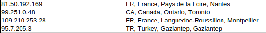

# IP to Location Mapping Script

This Python script is designed to extract unique IP addresses from a MongoDB collection and map them to their geographic locations using the IP2Location library. The results are then saved into a CSV file for further analysis. This script is part of a larger project focused on transforming customer behavior data on the Glamira website into actionable insights, processing over 40 million data records.

---

## Features
- Connects to a MongoDB database to retrieve customer behavior records.
- Extracts unique IP addresses from the data.
- Maps each IP to its geographic information, including country, region, and city.
- Outputs the results to a CSV file for easy integration and analysis.

---

## Requirements

The script relies on the following tools and libraries:

- **MongoDB**: To store and retrieve customer behavior data.
- **IP2Location**: For geographic mapping of IP addresses.
- **Logging**: For debugging and tracking execution.

### Python Libraries
Ensure the following libraries are installed:
- `pymongo`
- `IP2Location`
- `csv`
- `logging`

---

## Setup

1. Clone the repository:
   ```bash
   git clone <repository_url>
   cd <repository_folder>
   ```

2. Install the required Python libraries:
   ```bash
   pip install pymongo IP2Location
   ```

3. Set up the IP2Location binary database file:
   - Download the `IP-COUNTRY-REGION-CITY.BIN` file from the [IP2Location website](https://www.ip2location.com/).
   - Or extract the file "IP-COUNTRY-REGION-CITY.zip" provided in script directory to obtain the IP2Location binary database file.
   - Place the file in the script directory.

4. Update the MongoDB connection string and database details in the script:
   ```python
   client = MongoClient("mongodb://<your_mongo_host>:<port>/", serverSelectionTimeoutMS=20000)
   db = client["<your_database_name>"]
   collection = db["<your_collection_name>"]
   ```

---

## Execution

Run the script using Python:
```bash
python ip2location.py
```

Output:
- Logs are saved in `ip_mapping.log`.
- The resulting CSV file (`ip_location_mapping.csv`) contains the IP mappings.

---

## Output Example
**The output CSV file will have the following format**


---

## Notes

- This script is a foundational component of a broader project analyzing customer behavior data on Glamira.
- Ensure MongoDB is properly configured and accessible before running the script.
- Large datasets may require additional optimizations for memory and execution time.

---

## License

This project is licensed under the MIT License. See the LICENSE file for details.

---

## Contributions

Contributions are welcome! Please submit issues and pull requests for improvements.

---

## Contact

For inquiries, please contact [[huynhluc2910@gmail.com](mailto\:your-email@example.com)].

